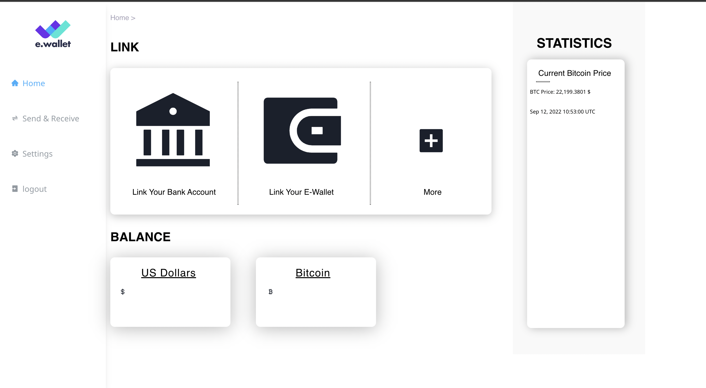

## Install & run

Make sure you have nodejs `18.0.0` or higher and npm `8.6.0` or higher installed. Install dependencies with:

```bash
npm install
```

Once it's done start up a local server with:

```bash
npm run dev
```

To create a production build:

```bash
npm run build
```
